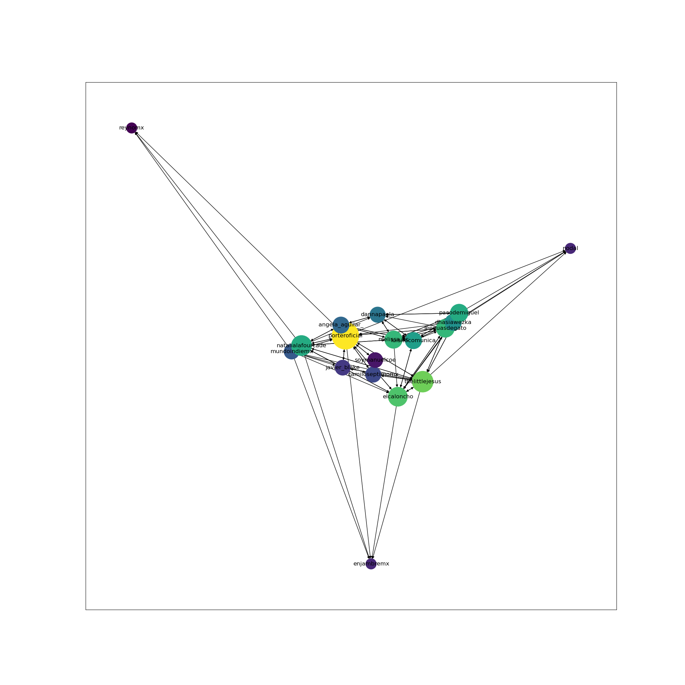
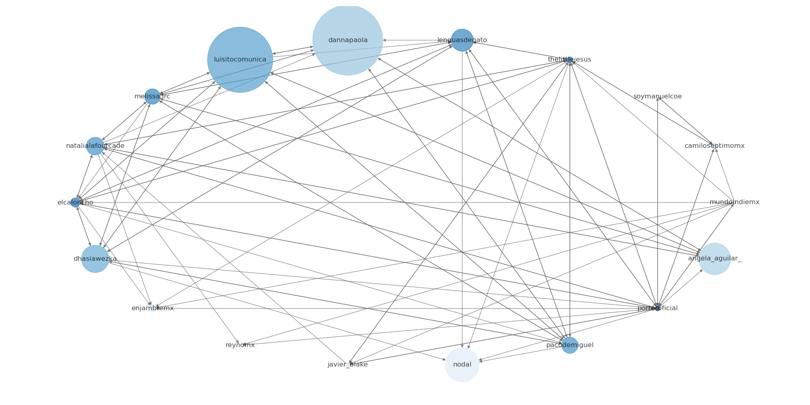

# Social Network Analysis: Instagram (in progress)
Félix Ernesto Charry Pastrana - charrypastranaernesto@gmail.com
## _Question_: given an input Instagram account, what is the **network associated with it** and what are the **central accounts**?
### Context: 
1. Accounts of influencers (followers >> followees)
2. Account text related with Mexico: flag, mx, mex
3. Only bussines account of Creators & Celebrities category or non-bussines account
### Procedure: 
- Given a seed_1 account, find similar accounts
- Filter the results using step 2. 
- Find similar accounts of most network-related account in the filter result (seed_2)
### import networkx as nx
***
⌨️ with ❤️! 📌

  
  

